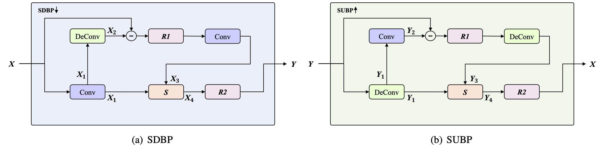

# SuperCodec: A Neural Speech Codec with Selective Back-Projection Network
[](https://exercise-book-yq.github.io/SuperCodec-Demo/)
[](https://arxiv.org/abs/2407.20530)

## Updates

- Code release. (Jul. 27, 2024)
- Online demo at Github See [here](https://exercise-book-yq.github.io/SuperCodec-Demo/). (Aug. 13, 2023)
- Supports 16-48 kHz at variable bitrates. (Jul. 27, 2024)

In this [paper](https://arxiv.org/abs/2407.20530), we present SuperCodec, a neural speech codec that replaces the standard feedforward up- and downsampling layers with Selective Up-sampling Back Projection (SUBP) and Selective Down-sampling Back Projection (SDBP) modules. Our proposed method efficiently preserves the information, on the one hand, and attains rich features from lower to higher layers of the network, on the other. Additionally, we propose a selective feature fusion block in the SUBP and SDBP to consolidate the input feature maps

<table style="width:100%">
  <tr>
    <td></td>
  </tr>
  <tr>
    <th>Supercodec</th>
  </tr>
</table>

## Pre-requisites

1. Clone this repo: `git clone https://github.com/exercise-book-yq/Supercodec.git`

2. CD into this repo: `cd Supercodec`

3. Install python requirements: `pip install -r requirements.txt`


## Training Example

```python
# train
python train.py --config config_v1.json
```

## Inference Example

```python
# inference
python inferece.py --checkpoint_file [generator checkpoint file path]
```

## Additional Experiments
Objective evaluation testing on our test set from VCTK at <b>16 kHz</b> sampling rate. We compare our proposed method with existing various codecs trained with the same configuration.
| Model         | Bitrate   | ViSQOL | STOI(%)  | WARP-Q(↓)  |
| -------------| ---------| -------| ---------| -----------|
| Supercodec | 1 kbps| 3.118  | 84.80    | 2.219      |
| TiCodec       | 1 kbps   | 2.490  | 80.21    | 2.578      |
| HiFiCodec     | 1 kbps   | 2.060  | 75.19    | 2.840      |
| EnCodec       | 1 kbps   | 2.202  | 76.53    | 2.687      |

Objective evaluation testing on our test set from VCTK at 24 kHz sampling rate. We compare our proposed method with existing various codecs trained with the same configuration.
| Model       | Bitrate  | ViSQOL | STOI(%) | WARP-Q(↓) |
| ----------- | --------| -------| --------| ----------|
| Supercodec  | 1.5 kbps| 3.322  | 85.61   | 2.147     |
| TiCodec     | 1.5 kbps| 2.639  | 79.03   | 2.539     |
| HiFiCodec   | 1.5 kbps| 2.026  | 76.80   | 2.761     |
| EnCodec     | 1.5 kbps| 2.202  | 79.81   | 2.569     |

All models are trained on LibriTTS.

## References

- https://github.com/jik876/hifi-gan
- https://github.com/OlaWod/FreeVC/tree/main
- https://github.com/lucidrains/audiolm-pytorch
- https://github.com/y-ren16/TiCodec
- https://github.com/yangdongchao/AcademiCodec
